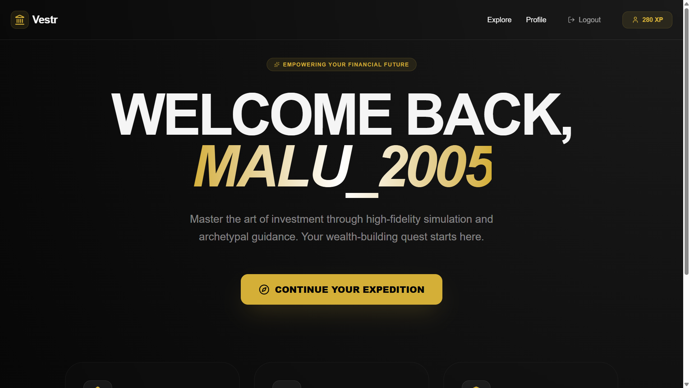
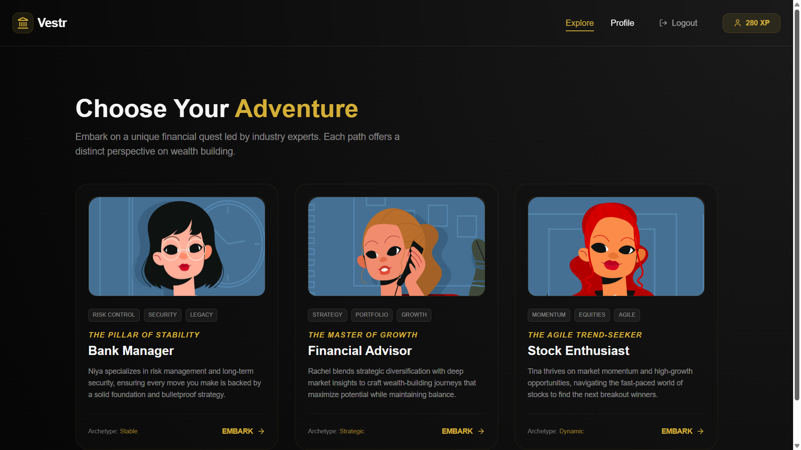
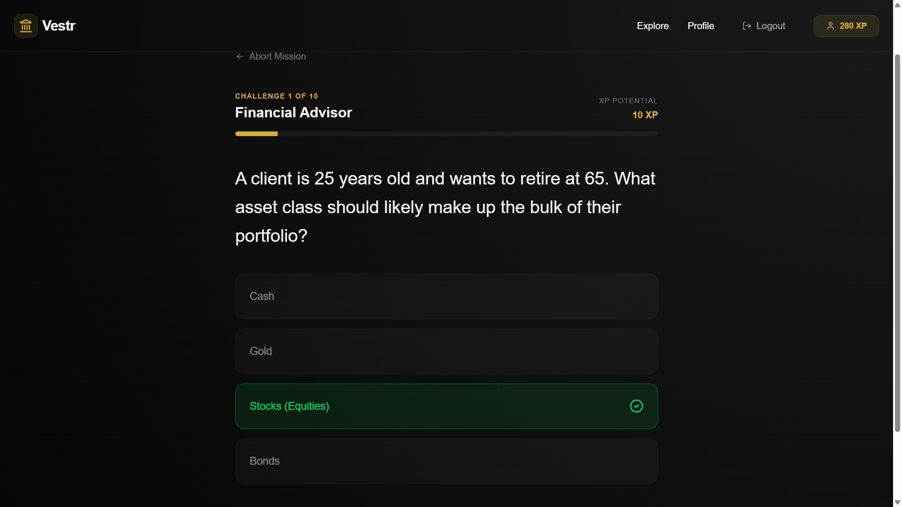
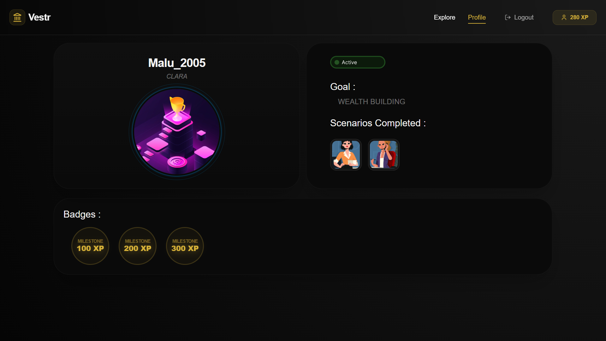
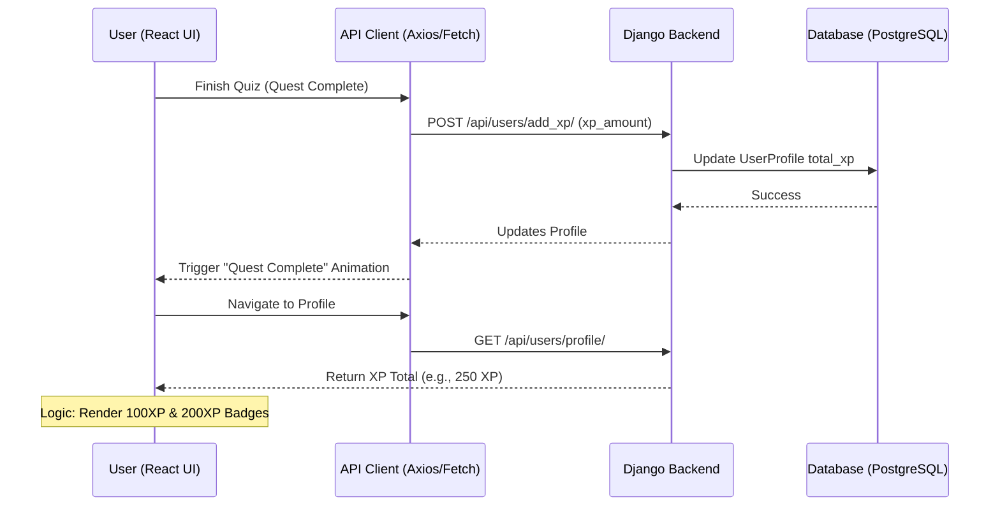
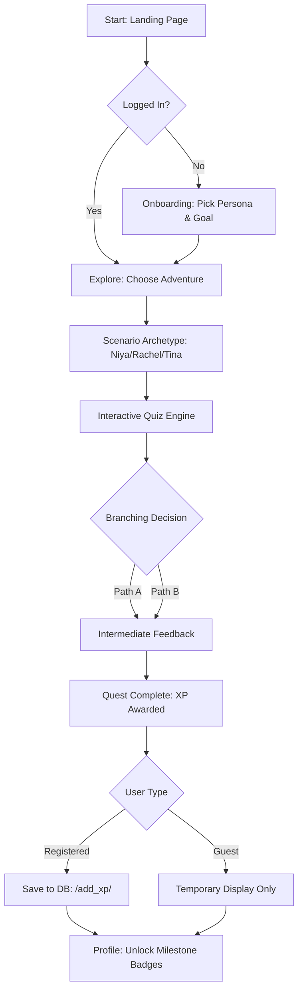

<p align="center">
  
</p>

# Vestr - Invest_Adventure_Simulator 🎯

## Basic Details

### Team Name: Drest

### Team Members
- Member 1: Athishta P A - Muthoot Institute of Technology and Science, Varikoli
- Member 2: Malavika V - Muthoot Institute of Technology and Science, Varikoli

### Hosted Project Link
 - [https://vestr-invest-adventure-simulator-7ykl3fv7h.vercel.app/](https://vestr-invest-adventure-simulator-7ykl3fv7h.vercel.app/)

### Project Description
Invest Adventure Simulator turns learning about investing into an interactive story game, where users make choices to "level up" their financial knowledge. It's designed for quick hackathon development using simple web tools.

### The Problem statement
Women face significant barriers to investing, including lower market participation (only 28% of women invest vs 42% men), confidence gaps, and life events like career breaks. Dry financial education often fails to engage or empower this demographic.

### The Solution
A web-based gamified app that guides users through branching investment adventures, earning XP and badges by mastering concepts like diversification and compound interest. Built as a choose-your-own-adventure with quizzes, it transforms finance education into engaging quests tailored for women.

---

## Technical Details

### Technologies/Components Used

**Software:**
- Languages used: JavaScript, TypeScript, Python, HTML, CSS
- Frameworks used: React 19, Django 4.2
- Libraries used: Vite, Tailwind CSS, Framer Motion, Django REST Framework, Axios, WhiteNoise, Gunicorn
- Tools used: VS Code, Git, Vercel (Frontend), Render (Backend)

---

## Features

List the key features of your project:
- **Character Onboarding**: New users select an avatar persona (Professional Clara / Student Maya) and set financial goals.
- **Adventure Scenarios**: Branching stories featuring archetypes like Niya (Stable), Rachel (Strategic), and Tina (Dynamic).
- **Interactive Quiz Engine**: Real-time branching questions tailored to each scenario with instant feedback and animations.
- **XP & Badge System**: Earn XP and unlock milestone badges (100XP, 200XP, etc.) to track financial knowledge growth.

---

## Implementation

### For Software:

#### Installation
```bash
# Backend Setup
cd backend
python -m venv venv
venv\Scripts\activate        # Windows
# source venv/bin/activate   # macOS/Linux
pip install -r requirements.txt
python manage.py migrate

# Frontend Setup
cd ../frontend
npm install
```

#### Run
```bash
# Run Backend
cd backend
python manage.py runserver

# Run Frontend
cd ../frontend
npm run dev
```

---

## Project Documentation

### For Software:

#### Screenshots (Add at least 3)


*Home Page showing the Vestr interface*


*Adventure Explore Page with scenario archetypes*


*Interactive Quiz interface*


*Profile Page showing user details*

#### Diagrams

**System Architecture:**


*System Architecture: React Frontend communicates with Django REST API, backed by PostgreSQL/SQLite.*

**Application Workflow:**


*Workflow: Onboarding -> Scenario Selection -> Branching Stories -> Quizzes -> XP/Badge Accrual.*

---

## Additional Documentation

### For Web Projects with Backend:

#### API Documentation

**Base URL:** `https://vestr-backend.onrender.com/api` (Production) / `http://127.0.0.1:8000/api` (Local)

##### Endpoints

**POST /login/**
- **Description:** Authenticates a user and returns their profile details.
- **Request Body:**
```json
{
  "username": "user",
  "password": "password"
}
```

**POST /register/**
- **Description:** Registers a new user with persona and goals.
- **Request Body:**
```json
{
  "username": "user",
  "password": "password",
  "avatar": "clara",
  "goal": "retirement"
}
```

**GET /scenarios/list/**
- **Description:** Fetches all available investment adventure scenarios.

---

## Project Demo

### Video
 - [Link to Demo Video](https://drive.google.com/file/d/1TzXXwa7ILhBTU-JQBrXdzdSkHSNiNXVV/view?usp=sharing)

*The video demonstrates the complete user journey from onboarding to completing a quest and earning a badge.*

---

## AI Tools Used (Optional - For Transparency Bonus)

**Tool Used:** ChatGPT, Antigravity

**Purpose:** 
- Generated boilerplate React components
- Debugging assistance for Django API endpoints
- Documentation and implementation planning

**Key Prompts Used:**
- "Create a REST API endpoint for user authentication"
- "Update the README.md with team details and project abstract"

**Human Contributions:**
- Architecture design and planning
- Custom business logic implementation
- UI/UX design decisions

---

## Team Contributions

- Athishta P A: Frontend Development, UI/UX Design, API Integration
- Malavika V: Backend Development, Database Schema, Quiz Logic

---

## License

This project is licensed under the MIT License - see the [LICENSE](LICENSE) file for details.

---

Made with ❤️ at TinkerHub
